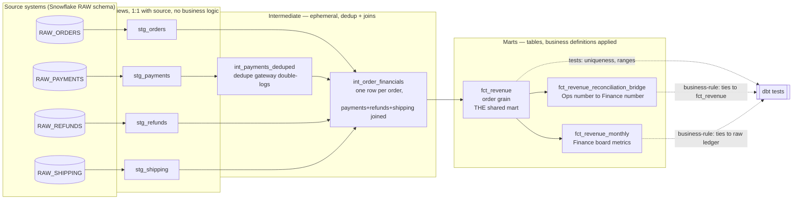

# Architecture Diagram — Engagement 01

**Layering rules (enforced, see RUBRIC.md "Architecture & modeling"):**
- Staging: `materialized: view`, pure rename/cast, zero business logic, always `select * from {{ source(...) }}` as the first CTE.
- Intermediate: `materialized: ephemeral`, dedup + joins only — no metric definitions yet.
- Marts: `materialized: table`, this is where "what counts as revenue" decisions get applied.
- Every model reaches its sources exclusively through `ref()`/`source()` — never a hardcoded table name.
