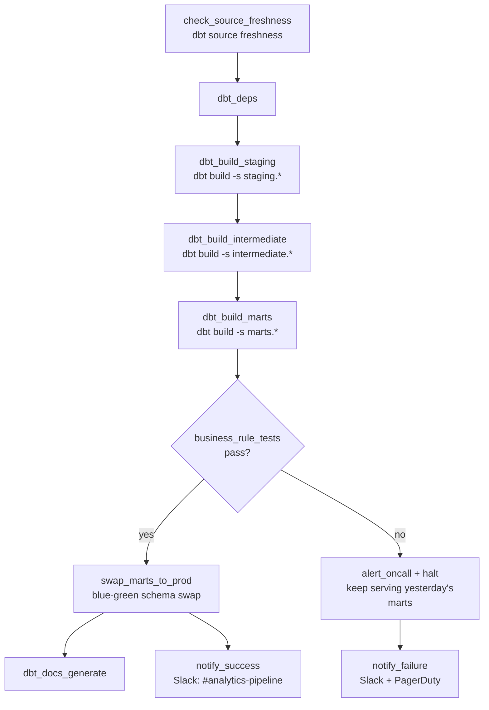

# Orchestration Design — Engagement 01

**Tool:** Airflow (design translates directly to Dagster assets/Prefect flows
if preferred — the dependency/freshness/alerting logic is tool-agnostic).
Design + reasoning is the deliverable; a running DAG is a stretch goal per
BRIEF.md.

## Schedule

Daily, **06:00 UTC** — after the source systems' overnight batch export
lands (assumed complete by 04:00 UTC based on the `sources.yml` freshness
thresholds of 36h/48h warn/error) and before the 08:00 UTC Finance/Ops
morning stand-up that consumes the dashboards.

## DAG structure

## Dependencies

- Each stage (`staging` → `intermediate` → `marts`) is its own Airflow task
  group, gated on the prior group's tests passing — mirrors the layered dbt
  DAG so a staging-level data problem never lets a mart silently build on top
  of it.
- `check_source_freshness` runs `dbt source freshness` first and fails the
  whole run before any model executes if `RAW_ORDERS`/`RAW_PAYMENTS` are
  stale past the `error_after` threshold in `sources.yml` — no point
  rebuilding marts on yesterday's data and calling it today's number.

## Idempotency / re-run story

- The generator's own load is `CREATE OR REPLACE` (full refresh, safe to
  re-run) — our dbt models mirror that: staging views recompute from
  whatever's in `RAW` at run time, and marts are `materialized: table`
  (full-refresh table builds, not incremental), so **re-running the same day
  twice produces identical output.** No `is_incremental()` state to
  corrupt, no double-counting risk from a retried run.
- If the DAG fails mid-run (e.g. at `dbt_build_intermediate`), a retry simply
  reruns `dbt build` from that point — dbt's own DAG-aware execution skips
  nothing incorrectly and nothing partial is left queryable, because of the
  blue-green swap step (below).

## Blue-green mart swap (why marts don't silently go wrong mid-build)

`dbt_build_marts` builds into a staging-out schema (e.g. `marts_building`),
not the schema the BI tool/board deck reads from. Only after the four
business-rule tests pass does `swap_marts_to_prod` atomically rename/swap
that schema into the live `marts` schema Finance and Ops query. If any
hard-stop test fails, the swap never happens — the live marts continue
serving **yesterday's last-known-good numbers**, and the board never sees a
wrong or half-built number, even transiently.

## Freshness checks

- `RAW_ORDERS`/`RAW_PAYMENTS`: warn at 36h stale, error at 48h — wired into
  `sources.yml`, checked by `check_source_freshness` before any build.
- `RAW_REFUNDS`/`RAW_SHIPPING`: no freshness SLA defined yet in the
  scaffold — flagged as a gap to close with the Data Lead (refunds in
  particular feed the reconciliation bridge and deserve the same SLA as
  orders/payments).

## Failure alerting

| Failure type | Channel | Who |
|---|---|---|
| Source freshness breach | Slack `#analytics-pipeline` | Data engineering (source-system owners) |
| Generic test failure (staging/intermediate) | Slack `#analytics-pipeline` + PagerDuty (business-hours only) | On-call analytics engineer |
| Business-rule test failure (marts) | Slack `#analytics-pipeline` + PagerDuty (24/7 — this is board-facing) | On-call analytics engineer |
| Successful run | Slack `#analytics-pipeline` (info-level) | — |

## "If this pipeline fails at 2am, what happens?" (the defense question)

1. The blue-green swap means the board/Ops dashboards keep serving
   yesterday's numbers — nothing wrong or half-built is ever visible.
2. PagerDuty pages the on-call analytics engineer for a marts-level
   business-rule failure (board-facing data), but *not* for a routine
   source-freshness warn (that's a Slack-only, business-hours issue).
3. The on-call engineer's first move is `dbt build --select
   result:error+ --state ./last_run` (rerun only what failed and its
   downstream) once the underlying issue (source data or code) is fixed —
   no need to rebuild the whole DAG from scratch.
4. If it's a source-data issue (e.g. `no_over_refunding` firing), a second,
   separate notification goes to the source-system team — the analytics
   engineer's job is to *not* patch it in the warehouse, per RUBRIC.md's
   non-negotiables.
