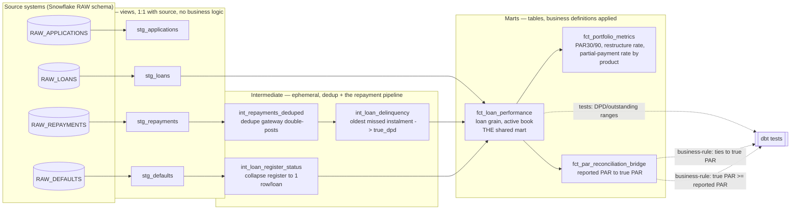

# Architecture Diagram — Engagement 04

**Layering rules (enforced, see RUBRIC.md "Architecture & modeling"):**
- Staging: `materialized: view`, pure rename/cast, zero business logic.
- Intermediate: `materialized: ephemeral`, dedup + the repayment-ledger-to-
  delinquency-state pipeline — this is where "what counts as missed" logic
  lives, but not yet "what counts as at-risk."
- Marts: `materialized: table`, DPD thresholds and the active-book filter
  are applied here.
- `stg_applications` is intentionally NOT wired into the loan-performance
  pipeline — loans, not applications, are the entry point for PAR. It's
  modeled and tested (per the source data being provided) but not a
  dependency of any downstream risk mart, and that's a deliberate scoping
  choice, not an oversight.
