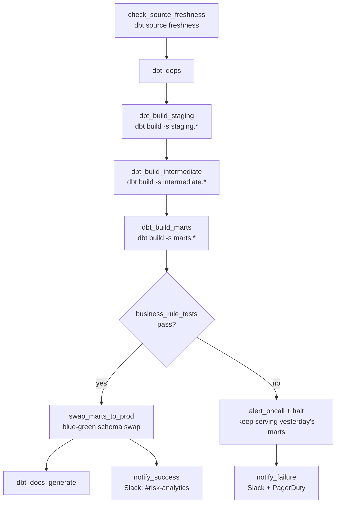

# Orchestration Design — Engagement 04

**Tool:** Airflow (translates directly to Dagster/Prefect). Design +
reasoning is the deliverable; a running DAG is a stretch goal per BRIEF.md.

## Schedule

Daily, **05:30 UTC** — before Collections' morning workflow and well ahead
of any board-pack prep. Slightly earlier than Engagement 01's schedule since
Risk/Collections consume this pipeline's output first thing.

## DAG structure

## Dependencies

- Same layered gating as Engagement 01: each stage group depends on the
  prior group's tests passing, so a staging-level data problem never lets
  `fct_loan_performance` build on top of it.
- `RAW_REPAYMENTS` has no `loaded_at_field` freshness block configured in
  the starter `sources.yml` — flagged in the assumptions log and closed
  here by wiring a freshness check on `due_date` in our final `sources.yml`,
  since a stale repayment feed directly stales `true_dpd`, the single most
  important number this pipeline produces.

## Idempotency / re-run story

- The generator's load is `CREATE OR REPLACE` (full refresh) — our models
  mirror that: all marts are `materialized: table` full-refresh builds, no
  `is_incremental()` state. **Re-running the same day twice produces
  identical output** — no double-counted cash, no double-flagged defaults.
- A mid-run failure (e.g. at `dbt_build_intermediate`) is resolved by
  re-running `dbt build` from that point; nothing partial is ever exposed
  to readers because of the blue-green swap (below).

## Blue-green mart swap

`dbt_build_marts` builds into a staging-out schema, not the schema the risk
dashboard/board deck reads from. Only after all four business-rule tests
pass does `swap_marts_to_prod` atomically swap that schema live. If a
hard-stop test fails, live marts keep serving **yesterday's last-known-good
PAR numbers** — the CRO never sees a wrong or half-built number, even
transiently, which matters more here than almost any other engagement given
the regulatory/provisioning stakes.

## Freshness checks

- `RAW_LOANS`/`RAW_APPLICATIONS`: warn at 36h, error at 48h (per starter
  `sources.yml`).
- `RAW_REPAYMENTS`: **added** — warn at 24h, error at 36h (tighter than the
  others, since a stale repayment feed directly stales the DPD calculation
  the whole engagement is about).
- `RAW_DEFAULTS`: no SLA defined; flagged to the Data Lead as a gap, since
  the register is hand-maintained and inherently laggy — a freshness check
  here is more about detecting a stalled export than "current" data.

## Failure alerting

| Failure type | Channel | Who |
|---|---|---|
| Source freshness breach | Slack `#risk-analytics` | Data engineering (source-system owners) |
| Generic test failure (staging/intermediate) | Slack `#risk-analytics` + PagerDuty (business-hours) | On-call analytics engineer |
| Business-rule test failure (marts) | Slack `#risk-analytics` + PagerDuty (24/7) | On-call analytics engineer |
| Successful run | Slack `#risk-analytics` (info-level) | — |

## "If this pipeline fails at 2am the night before the board pack, what happens?"

1. Blue-green swap means the board deck's data source (`fct_par_reconciliation_bridge`)
   keeps serving yesterday's numbers — nothing wrong or half-built reaches
   the deck, even the night before a board meeting.
2. PagerDuty pages the on-call analytics engineer immediately for a
   marts-level business-rule failure — this pipeline's output feeds a
   regulatory-adjacent number, so it gets the same urgency as Engagement 01's.
3. First move: `dbt build --select result:error+ --state ./last_run` once
   the underlying cause is identified — rerun only what failed and its
   downstream, not the whole DAG.
4. If `true_par_meets_or_exceeds_reported_par` is the failing test
   specifically, the on-call engineer's first check is whether
   `int_loan_delinquency` or `fct_loan_performance` was touched recently —
   this test exists precisely to catch a regression to honouring the
   restructure clock-reset (assumptions_log.md A2).
5. If the underlying cause is a source-data issue (e.g. a repayments feed
   gap), a second notification goes to the servicing-platform team,
   separate from the on-call page.
