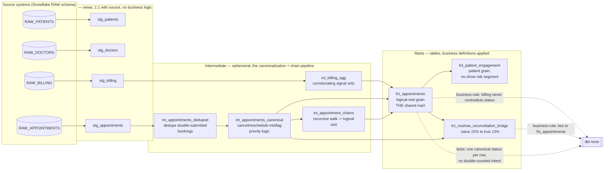

# Architecture Diagram — Engagement 05

**Layering rules (enforced, see RUBRIC.md "Architecture & modeling"):**
- Staging: `materialized: view`, pure rename/cast, zero business logic —
  notably, raw status synonyms (`no_show`/`missed`/`no-show`) are **not**
  collapsed here; that's canonicalization, a business decision.
- Intermediate: `materialized: ephemeral`. This is where the actual
  engagement lives — dedup, then canonicalize (dedup must run first, see
  assumptions_log.md A4), then resolve chains, in that dependency order.
- Marts: `materialized: table`. Grain-defining decisions (logical visit,
  patient) and denominator choices are applied here.
- `int_billing_agg` is a parallel branch that never feeds
  `int_appointments_canonical`/`int_appointment_chains` — billing joins in
  only at the very end, in `fct_appointments`, strictly as a corroborating
  column set (assumptions_log.md A6).
