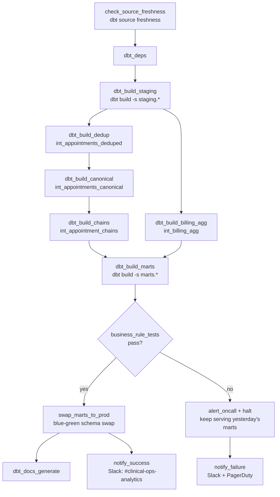

# Orchestration Design — Engagement 05

**Tool:** Airflow (translates directly to Dagster/Prefect). Design +
reasoning is the deliverable; a running DAG is a stretch goal per BRIEF.md.

## Schedule

Daily, **05:00 UTC** — clinics open early; Clinical Ops and the Patient
Access Manager want the prior day's reconciled attendance numbers before
the first patient arrives.

## DAG structure

## Dependencies

- The intermediate layer has a **strict internal order** unlike prior
  engagements: dedup → canonicalize → chains, each gated on the previous
  step's tests, because canonicalization's link-validation logic depends on
  duplicates already being resolved (assumptions_log.md A4) and chain
  resolution depends on canonical status being correct.
- `int_billing_agg` runs in parallel off `stg_billing` — it has no
  dependency on the appointment-canonicalization branch and only meets it
  at the final `fct_appointments` join.

## Idempotency / re-run story

- Generator load is `CREATE OR REPLACE` (full refresh); all marts are
  `materialized: table` full-refresh builds — **re-running the same day
  twice produces identical output.** No incremental state, no
  double-counted visits from a retried run.
- A mid-run failure (e.g. at `dbt_build_chains`) is resolved by re-running
  `dbt build` from that point; the blue-green swap (below) means nothing
  partial is ever exposed to readers regardless of where a retry starts.

## Blue-green mart swap

`dbt_build_marts` builds into a staging-out schema, not the schema
Clinical Ops/the board deck reads from. Only after all four business-rule
tests pass does `swap_marts_to_prod` atomically swap it live. A hard-stop
failure means live marts keep serving **yesterday's last-known-good
no-show numbers** — nobody making a call on the reduction initiative ever
sees a wrong or half-built number, even transiently.

## Freshness checks

- `RAW_APPOINTMENTS`: warn at 36h, error at 48h (per starter `sources.yml`)
  — this is the pipeline's most time-sensitive feed.
- `RAW_BILLING`: warn at 48h, error at 72h (looser, matching claims'
  natural posting lag — a stale billing feed doesn't stale the attendance
  number, only the corroboration signal).
- `RAW_PATIENTS`/`RAW_DOCTORS`: no explicit SLA in the starter scaffold;
  low-churn dimension tables, checked but not alerting-critical.

## Failure alerting

| Failure type | Channel | Who |
|---|---|---|
| Source freshness breach | Slack `#clinical-ops-analytics` | Data engineering (source-system owners) |
| Generic test failure (staging/intermediate) | Slack `#clinical-ops-analytics` + PagerDuty (business-hours) | On-call analytics engineer |
| Business-rule test failure (marts) | Slack `#clinical-ops-analytics` + PagerDuty (24/7 — feeds a board-level initiative) | On-call analytics engineer |
| Successful run | Slack `#clinical-ops-analytics` (info-level) | — |

## "If this pipeline fails at 2am, what happens?"

1. Blue-green swap means Clinical Ops' dashboard and the board deck's data
   source keep serving yesterday's numbers — nothing wrong or half-built
   is ever visible, even the morning before a board update on the
   initiative.
2. PagerDuty pages the on-call analytics engineer for a marts-level
   business-rule failure. `no_double_counted_visit_intent` firing gets
   treated as the highest-priority investigation of the four — it's the
   test most directly tied to RUBRIC.md's correctness weighting.
3. First move: `dbt build --select result:error+ --state ./last_run` once
   the cause is identified — rerun only what failed and its downstream.
4. If the root cause traces to a front-desk keying pattern (e.g. one
   location suddenly producing a spike in `unresolved` rows), a second
   notification goes to the Patient Access Manager, separate from the
   on-call page — per BRIEF.md, that's a front-desk training/process fix,
   not a warehouse patch.
