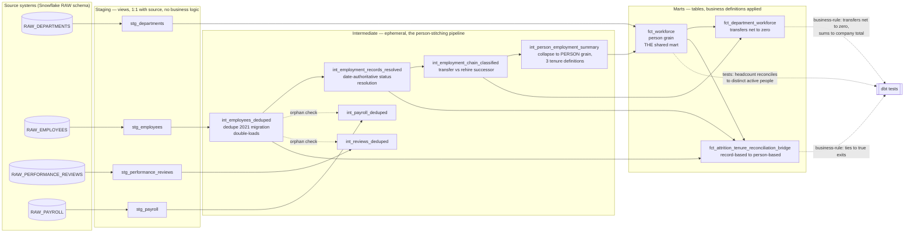

# Architecture Diagram — Engagement 08

**Layering rules (enforced, see RUBRIC.md "Architecture & modeling"):**
- Staging: `materialized: view`, pure rename/cast, zero business logic —
  status/date reconciliation and duplicate detection are NOT done here.
- Intermediate: `materialized: ephemeral`. Strict internal order: dedupe →
  resolve status/date conflicts → classify transfer/rehire → collapse to
  person grain, each stage depending on the previous being correct first.
- Marts: `materialized: table`. Person-grain choice (A1), the attrition
  window, and department attribution rules are applied here.
- `int_payroll_deduped`/`int_reviews_deduped` are parallel branches that
  never feed the person-stitching pipeline — they only need to know which
  `employee_id`s survived dedup, checked against `int_employees_deduped`
  directly.
