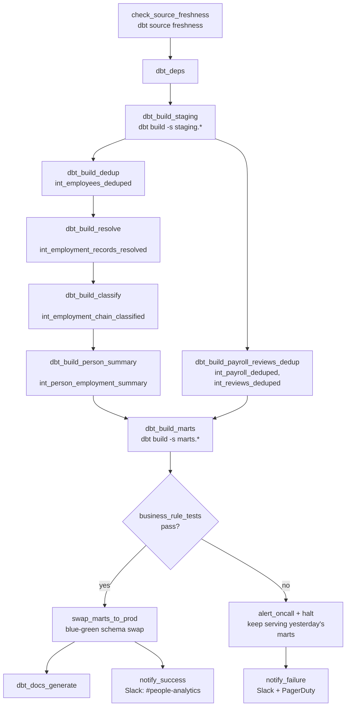

# Orchestration Design — Engagement 08

**Tool:** Airflow (translates directly to Dagster/Prefect). Design +
reasoning is the deliverable; a running DAG is a stretch goal per BRIEF.md.

## Schedule

Daily, **04:00 UTC** — HR/Finance's downstream reporting tools and the
CPO's dashboard need overnight HRIS export changes reflected before the
US/UK workday starts.

## DAG structure

## Dependencies

- The intermediate layer has a **strict internal order**, same principle as
  Engagement 05's canonicalization pipeline: dedupe → resolve status/date
  conflicts → classify transfer/rehire → collapse to person, each gated on
  the previous step's tests, because each stage's logic depends on the
  prior stage already being correct (classification needs resolved
  status; person-summary needs correct classification).
- `int_payroll_deduped`/`int_reviews_deduped` run in parallel off staging —
  they only need `int_employees_deduped`'s surviving `employee_id` set for
  their orphan check, not the full resolve/classify/summary chain.

## Idempotency / re-run story

- Generator load is `CREATE OR REPLACE` (full refresh); all marts are
  `materialized: table` full-refresh builds — **re-running the same day
  twice produces identical output.** No incremental state, no
  double-counted headcount or attrition from a retried run.
- A mid-run failure (e.g. at `dbt_build_classify`) is resolved by
  re-running `dbt build` from that point; the blue-green swap means nothing
  partial is ever exposed to readers regardless of where a retry starts.

## Blue-green mart swap

`dbt_build_marts` builds into a staging-out schema, not the schema the
CPO's dashboard/board deck reads from. Only after all four business-rule
tests pass does `swap_marts_to_prod` atomically swap it live. A hard-stop
failure means live marts keep serving **yesterday's last-known-good
headcount/attrition/tenure numbers** — nobody making a board-prep decision
ever sees a wrong or half-built number, even transiently.

## Freshness checks

- `RAW_EMPLOYEES`: warn at 24h, error at 48h — the pipeline's most
  time-sensitive feed; headcount and attrition both derive from it directly.
- `RAW_PAYROLL`: warn at 48h, error at 72h — payroll naturally lags a bit
  behind HRIS status changes.
- `RAW_PERFORMANCE_REVIEWS`/`RAW_DEPARTMENTS`: no explicit SLA in the
  starter scaffold; low-churn/annual-cycle tables, checked but not
  alerting-critical.

## Failure alerting

| Failure type | Channel | Who |
|---|---|---|
| Source freshness breach | Slack `#people-analytics` | Data engineering / HRIS owners |
| Generic test failure (staging/intermediate) | Slack `#people-analytics` + PagerDuty (business-hours) | On-call analytics engineer |
| Business-rule test failure (marts) | Slack `#people-analytics` + PagerDuty (24/7 — feeds the board) | On-call analytics engineer |
| Successful run | Slack `#people-analytics` (info-level) | — |

## "If this pipeline fails at 2am, what happens?"

1. Blue-green swap means the CPO's dashboard and the board deck's data
   source keep serving yesterday's numbers — nothing wrong or half-built
   is ever visible, even the morning of a board update.
2. PagerDuty pages the on-call analytics engineer for a marts-level
   business-rule failure. `transfers_net_to_zero_across_departments` or
   `department_headcount_sums_to_company_total` firing gets investigated
   first — these are the two RUBRIC.md names explicitly, and a failure
   there usually points to a specific, findable bug in the classification
   layer rather than a source-data issue.
3. First move: `dbt build --select result:error+ --state ./last_run` once
   the cause is identified — rerun only what failed and its downstream.
4. If the root cause traces to the HRIS export itself (e.g. a spike in
   status/date conflicts or a new pattern the classifier doesn't handle),
   a second notification goes to the Data Lead, separate from the on-call
   page — per BRIEF.md, that's a source-system fix, not a warehouse patch.
